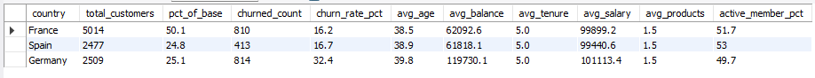
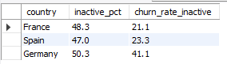

# Bank Customer Churn Analysis

## Project Overview
This project is an exploratory data analysis (EDA) using SQL to understand churn patterns at a bank. Churn means customers who stop using the bank's services. The analysis was built around business questions from the stakeholder's point of view (the party who needs the analysis, in this case the bank's management team). The goal is to produce actionable recommendations to reduce churn.

## About the Dataset
The dataset used is the **Bank Customer Churn Dataset** from Kaggle. It contains data for 10,000 customers of a multistate bank (a bank that operates across several countries), with the following 12 columns:

| Column | Description |
|---|---|
| customer_id | Unique identifier for each customer |
| credit_score | Customer's credit score. A higher score indicates a better credit history |
| country | Country where the customer is registered (France, Spain, or Germany) |
| gender | Customer's gender |
| age | Customer's age, in years |
| tenure | How long the customer has been with the bank, in years |
| balance | The customer's account balance |
| products_number | Number of bank products the customer holds, e.g. savings, credit card, or loan |
| credit_card | Whether the customer holds a credit card (1 = yes, 0 = no) |
| active_member | Whether the customer is actively using their account (1 = active, 0 = inactive) |
| estimated_salary | Customer's estimated annual salary |
| churn | Churn status. This is the target variable of the analysis (1 = customer left, 0 = customer stayed) |

## Business Questions (Stakeholder Questions)
This analysis was built to answer 4 questions:

1. What attributes are more common among churners than non-churners?
2. What do the overall demographics (population characteristics) of the bank's customers look like?
3. Is there a difference between German, French, and Spanish customers in terms of account behavior?
4. What types of segments exist within the bank's customers?

Note: the original question set also included "can churn be predicted using the variables in the data?" This question is out of scope for SQL-based EDA, because it requires predictive modeling using machine learning. It is left as a direction for future work rather than part of this analysis.

## Data Cleaning
Before moving into analysis, the raw data went through a cleaning process (see `00_data_cleaning.sql`), carried out in the following stages.

**1. Staging table**
The raw data was copied from the original `cust_info` table into a new table, `cust_info_staging`, using a `CREATE TABLE` followed by an `INSERT ... SELECT`. This keeps the raw data untouched, so all cleaning and analysis work happens on a separate copy.

**2. Duplicate check**
The total row count was compared against the count of distinct `customer_id` values. Both returned 10,000, confirming there are no duplicate customers in the dataset.

**3. Standardization**
The `country` and `gender` columns were checked for inconsistent formatting (whitespace) using `TRIM()`, then updated to remove any leading or trailing spaces. This ensures values used later for grouping (`GROUP BY country`) aren't accidentally split into separate groups due to formatting differences.

**4. Null and blank value check**
Every column was checked for missing data, split by data type:
- Numeric columns (`customer_id`, `credit_score`, `age`, `tenure`, `balance`, `products_number`, `credit_card`, `active_member`, `estimated_salary`, `churn`) were checked using `IS NULL`.
- Text columns (`country`, `gender`) were checked using `IS NULL OR = ''`, since a text field can be blank without technically being NULL.

Categorical columns (`gender`, `credit_card`, `active_member`, `churn`) were also checked with `SELECT DISTINCT` to confirm they only contain valid values, and `age`, `tenure`, and `products_number` were checked for out-of-range or invalid values (age below 18, negative tenure, zero or negative product count).

**Result**: the dataset was found to be clean, with no duplicates and no null or blank values in any column.

## Exploratory Data Analysis (EDA)
Each business question was answered using a separate query file. The SQL code isn't reproduced here, refer to the linked file for the full query. This section focuses on the query result and what it means.

### Question 1: Attributes that differ between churners and non-churners
**File**: `02_churners_vs_non_churners.sql`, which compares the average of each customer attribute between the churned and stayed groups.

**Key findings**:
- Out of 10,000 customers, 2,037 churned (20.4%) and 7,963 stayed (79.6%).
- Churned customers are older on average (44.8 years) than customers who stayed (37.4 years).
- Churned customers hold a higher average balance (91,108.5) than those who stayed (72,745.3).
- The clearest gap is in active status: only 36.1% of churned customers were active, compared to 55.5% of customers who stayed.
- Credit score (645.4 vs 651.9), credit card ownership (69.9% vs 70.7%), product count (1.5 vs 1.5), and estimated salary (101,465.7 vs 99,738.4) show little to no meaningful differences.

Active status produced the clearest gap above, so the same file follows up on it directly by splitting the question into two separate things: how common inactivity is (**prevalence**), and how much it actually costs in churn once a customer is inactive (**consequence**).

- How common inactivity is stays fairly similar across countries: 48.3% in France, 50.3% in Germany, 47.0% in Spain. The consequence doesn't. Churn among inactive customers is 21.1% in France and 23.3% in Spain, but 41.1% in Germany. Inactivity is about equally common everywhere, but far more costly in Germany.

- The same pattern shows up by age. Prevalence is fairly flat (49.0% at 18-29, rising only slightly to 53.3% at 40-49) and drops at 60+ (21.1%). But churn among inactive customers climbs sharply with age: 9.8% at 18-29, 13.6% at 30-39, 38.0% at 40-49, 81.2% at 50-59, and 85.6% at 60+.

### Question 2: Overall customer demographics
**File**: `01_overall_demographics.sql`, which calculates summary statistics for the full customer base, then breaks them down by gender and age group.

- The bank has 10,000 customers across 3 countries, aged 18 to 92 (average 38.9 years).
- Average credit score is 650.5, average balance is 76,485.9, and customers hold 1.5 products on average.
- 51.5% of customers are active, and the overall churn rate is 20.4%.

| Age Bracket | Customers | % of Total | Churn Rate | Active Member % |
|---|---|---|---|---|
| 18-29 | 1,641 | 16.4% | 7.6% | 51.0% |
| 30-39 | 4,346 | 43.5% | 10.9% | 50.2% |
| 40-49 | 2,618 | 26.2% | 30.8% | 46.7% |
| 50-59 | 869 | 8.7% | 56.0% | 57.1% |
| 60+ | 526 | 5.3% | 27.9% | 78.9% |

- Churn rate rises steadily from the youngest group up to a peak at ages 50-59 (56.0%), then drops at age 60+ (27.9%). This drop lines up with active member rate, which is lowest at 40-49 (46.7%) and highest at 60+ (78.9%). Older customers who are still banking with this institution tend to still be actively using it.

- Male customers make up 54.6% of the base (5,457) with a churn rate of 16.5%, while female customers make up 45.4% (4,543) with a notably higher churn rate of 25.1%. The gap is broken down further below, by country and by age group, to see where it's highest.

| Country | Female Churn Rate | Male Churn Rate |
|---|---|---|
| France | 20.3% | 12.7% |
| Spain | 21.2% | 13.1% |
| Germany | 37.6% | 27.8% |

- Female customers churn more than male customers in every country, and the gap is widest in Germany (roughly 10 points, vs 7-8 points in France and Spain).

| Age Bracket | Female Churn Rate | Male Churn Rate | Gap |
|---|---|---|---|
| 18-29 | 9.9% | 5.6% | 4.3 pts |
| 30-39 | 14.2% | 8.3% | 5.9 pts |
| 40-49 | 36.1% | 26.0% | 10.1 pts |
| 50-59 | 62.9% | 49.6% | 13.3 pts |
| 60+ | 34.0% | 22.8% | 11.2 pts |

- Female customers churn more than male customers in every single age bracket. The gap also widens with age, from 4.3 points at 18-29 to 13.3 points at 50-59, more than 3 times wider. This suggests the gender effect isn't a flat, additive difference, but one that grows stronger as customers get older. Female customers aged 50-59 have the highest churn rate of any age-gender combination in the dataset.

### Question 3: Differences between German, French, and Spanish customers
**File**: `03_geographic_analysis.sql`, which compares customer count, churn rate, and average characteristics across the three countries, then drills further into the highest-risk segment.

- France has the largest customer base (5,014, or 50.1%), with a churn rate of 16.2%, close to Spain's 16.7% (2,477 customers, 24.8%).
- Germany, despite making up a similar share of customers as Spain (2,509, or 25.1%), has a churn rate twice as high at 32.4%.
- The one attribute that stands out for Germany is average balance (119,730.1), well above France (62,092.6) and Spain (61,818.1). Age, tenure, product count, and active member rate are all similar across the three countries.

- Among German customers aged 40 and above, 579 churned, a churn rate of 50.8%, with an average balance of 120,052.5 and an active member rate of only 47.7%.

That 50.8% figure blends every age from 40 upward into a single number, so it's broken down by individual age bracket below to see whether the risk is spread evenly across that range.

| Age Bracket (Germany only) | Customers | Churn Rate |
|---|---|---|
| 18-29 | 372 | 12.6% |
| 30-39 | 997 | 18.9% |
| 40-49 | 740 | 45.1% |
| 50-59 | 277 | **70.0%** |
| 60+ | 123 | 41.5% |

- The risk isn't spread evenly at all. It peaks sharply at ages 50-59 (70.0%), well above the blended 50.8% figure for "40 and above," then drops at 60+, mirroring the same age pattern seen bank-wide in Question 2.

Active status was already the clearest difference found in Question 1. The last check here is whether it compounds with being German and in the 50-59 bracket, or acts as a separate, unrelated factor.

| Active Status (Germany, age 50-59) | Customers | Churn Rate |
|---|---|---|
| Active | 131 | 51.9% |
| Inactive | 146 | 86.3% |

- Being German and aged 50-59 already carries a high churn rate even while still active (51.9%). Becoming inactive on top of that pushes churn to 86.3%. The two factors reinforce each other rather than simply adding up.

### Question 4: Customer segments at the bank
**File**: `04_customer_segmentation.sql`, which groups customers into 5 segments based on tenure, balance, product count, and active status. Active status is checked first, so every inactive customer is captured consistently, then the churn rate is compared per segment.

**Segmentation criteria**: each customer is checked against the following conditions in order, and placed into the first one they match:

1. **Loyal**: tenure of 6+ years, balance above 100,000, 2 or more products, and currently active.
2. **Non-Active**: not currently active (checked before the tenure/balance conditions below, so every inactive customer lands here rather than being caught by Established or At-Risk first).
3. **Established**: tenure of 4+ years and balance above 50,000 (only reached by active customers, since inactive ones were already placed above).
4. **At-Risk**: tenure of 2 years or less and balance of 50,000 or below (also only active customers at this point).
5. **Regular**: any active customer who doesn't fit the criteria above.

| Segment | Customers | % of Total | Churn Rate |
|---|---|---|---|
| Non-Active | 4,849 | 48.5% | 26.9% |
| Established | 1,661 | 16.6% | 17.0% |
| Loyal | 368 | 3.7% | 16.6% |
| At-Risk | 463 | 4.6% | 12.7% |
| Regular | 2,659 | 26.6% | 12.5% |

**Key findings**:
- With active status checked first, Non-Active now captures every inactive customer in the dataset (4,849, or 48.5% of the base), and this segment has the highest churn rate of all (26.9%).
- Established, now made up only of active customers who meet the tenure and balance criteria, has a churn rate of 17.0%, much lower than the 24.7% seen before active status was checked first, when the segment mixed active and inactive customers together.
- Loyal has the highest average balance (132,560.2) and product count (2.1) of any segment, but is no longer the lowest-churn segment. Regular (12.5%) and At-Risk (12.7%) are both lower. This suggests that once inactive customers are separated out properly, active status is a stronger churn driver than balance or product count on their own.

One detail is worth checking further. Loyal has the highest average product count (2.1) of any segment, and Established has the lowest (1.3), which lines up with Loyal's lower churn rate. But an average can hide a lot, so the table below breaks down churn rate by the exact number of products held, across the whole customer base rather than within just these five segments.

| Products Held | Customers | Churn Rate |
|---|---|---|
| 1 | 5,084 | 27.7% |
| 2 | 4,590 | **7.6%** |
| 3 | 266 | 82.7% |
| 4 | 60 | 100.0% |

- Two products is the safest spot (7.6% churn), clearly better than one (27.7%). But three or four products come with very high churn (82.7% and 100%). The sample at 3-4 products is small (326 customers combined), and this dataset doesn't explain the underlying cause, so this pattern is treated as an open question rather than a basis for encouraging unlimited product cross-selling.

## Conclusion
The highest-risk customer profile in this dataset is German, aged 50 to 59. Churn in this group is 70.0%, already high while the customer is still active (51.9%), and climbs to 86.3% once they become inactive. This is the sharpest and most concentrated risk found in the analysis, though also the smallest group (277 customers).

Age 40-49 tells a different but equally important story. Its churn rate (30.8%) is much lower than 50-59's. But the group is three times bigger (2,618 customers), so it contributes the largest share of total churn: 806 out of 2,037 churned customers (39.6%), more than any other age bracket. A strategy based only on churn rate would miss this.

Activity status is the most consistent driver in the entire dataset, not just among older customers. 63.9% of all churned customers were inactive at their last record. How common inactivity is stays roughly the same across every country and age group, at around 47-53% of customers. What it costs in churn does not: it ranges from under 25% in France and Spain to over 80% for customers aged 50 and up.

Gender adds another layer on top of these. Female customers churn more than male customers in every single country and every single age bracket, with no exceptions, and the gap widens as customers get older. This doesn't change which segment carries the highest risk, but it shows who to reach first within that segment.

One pattern has no clear explanation. Customers holding 3 or 4 products churn at 82.7% and 100%, far higher than customers holding 2 (7.6%, the lowest rate in the dataset), and this holds even among customers who are still active. The dataset doesn't explain why, so this is treated as an open question rather than a basis for any direct recommendation.

## Recommendations
The findings point to one root driver: activity status. Every recommendation below builds on it, starting from a monitoring foundation and moving up to the groups where follow-up is most urgent. The numbers behind each step come from the EDA sections above, and the limits of what they can prove are listed in the next section.

**1. Build a bank-wide activity monitoring program (the foundation)**
- Why: 63.9% of all churned customers were inactive at their last record. Inactivity is the clearest and most consistent signal in the dataset, and it is equally common everywhere (about 47-53% of customers regardless of country or age).
- What: flag every customer who becomes inactive, then route them to follow-up based on the risk levels in recommendations 2 and 3.
- KPI: the share of inactive customers contacted within 30 days, and the churn rate of contacted customers compared to those who are not contacted.
- This needs to be a standing policy rather than a one-off campaign, because inactivity shows up in every country and every age group.

**2. Give the highest-touch response to the smallest, riskiest group: German customers aged 50 to 59**
- Why: 277 customers with a 70.0% churn rate. The 146 who are already inactive churn at 86.3%, and even the 131 who are still active churn at 51.9%.
- What: direct contact from a relationship manager, personalized retention offers, and check-ins before signs of disengagement appear. Contact female customers first, since the gender gap is widest in Germany.
- The group is small enough that this level of attention is affordable, and the rate is extreme enough to justify it.

**3. Run the widest campaign where the volume is: the 40-49 age bracket, bank-wide**
- Why: 2,618 customers and 806 churned, the largest share of total churn (39.6%). The churn rate (30.8%) is lower than Germany's 50-59 group, but the volume makes it the biggest source of lost customers.
- What: reactivation outreach aimed at inactive customers in this bracket, where the churn rate is 38.0%, using scalable channels (targeted email, SMS, in-app prompts, and win-back offers). A generic marketing email is not enough, because the risk sits with customers who have already stopped using the bank actively.
- Expected impact: cutting this bracket's churn rate by 10 points would save roughly 260 customers per period (10% of 2,618).
- Contact female customers first in this bracket too, since the gap here is 10.1 points.

**4. Test product cross-selling with a small pilot (watchlist)**
- The 3-4 product pattern (82.7% and 100% churn) has no explanation in this dataset, so no direct action is recommended there yet. The first step is to find out why, for example by surveying or interviewing a sample of these customers.
- The pattern around 1 and 2 products is more promising: customers holding 1 product churn at 27.7%, while 2 products is the safest point in the entire dataset (7.6%). But the data cannot prove that a second product causes the lower churn, so do not push this broadly. Run a small controlled pilot first: offer a second product to one group of 1-product holders, leave a similar group untouched, and compare churn after a set period.
- This pilot doubles as a test of whether the 3-4 product pattern is cause or effect.

## Data Limitations
This dataset is a single snapshot. It records each customer's status at one point in time, so the order of events cannot be proven: the analysis can say that 63.9% of churned customers were inactive at their last record, but not that inactivity happened before the decision to leave. The dataset also doesn't include the reason a customer left. There is no survey or complaint data, so the recommendations above are based on patterns rather than confirmed causes. This matters most for the 3-4 product pattern, where the direction of cause and effect isn't known. The dataset also doesn't break down which specific products customers hold (savings, credit card, loan, etc.), which limits how specific a product-related recommendation can get. Finally, the five customer segments used in Question 4 (Loyal, Established, At-Risk, Non-Active, Regular) were defined for this analysis rather than provided by the bank, so the exact thresholds used (tenure, balance) are a starting point rather than a validated business definition.

## Tools Used
- MySQL (MySQL Workbench) for data cleaning and analysis
- Dataset: [Bank Customer Churn Dataset](https://www.kaggle.com/datasets/gauravtopre/bank-customer-churn-dataset) from Kaggle
